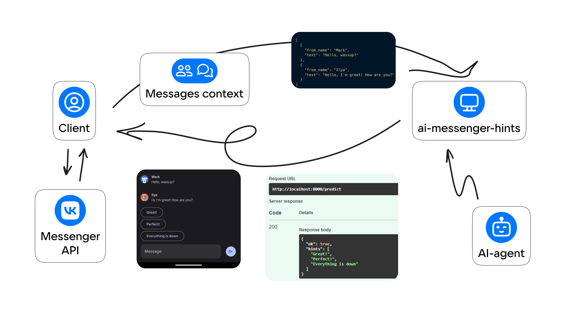

# Documentation (EN)


## What is in this repository?
Here is a simple web server with one endpoint for generating hints and integration with various AI agents.

## Terms
**Web server (API)** - FastAPI-based application, which is an HTTP API with a single endpoint for generating hints on messages.

**Endpoint (route)** - [see endpoint](https://en.wikipedia.org/wiki/Endpoint_interface)

**Hint** - a string with a possible answer to messages, which is generated by the AI-agent

**AI-agent (also application backend or AI-provider)** - AI-based text generation service. We generate and normalize hints for the API response using an AI-agent add-in (service prompt and hint parser).

**Service Prompt** - a message that is sent in all requests to the AI agent and sets the task of generating hints in a certain format.

**Hint parser** is a function that normalizes the AI-agent output (e.g., in case of erroneous/anomalous output format) and returns a list of hints for the API response.


## Application workflow
The context of the messages (the list of the most recent messages containing the text and information about the author) is used to send a request with a service prompt and messages to the AI agent. The service prompt describes the AI agent's task, which is to generate prompts and return them in a certain format. The AI-agent's response is normalized by the hint parser and returned in JSON format as a response.



## Usage
By default, the server part of the project does not use any libraries bound to AI-providers (such as openai or gpt4free). 
The project has built-in AI-providers - OpenAI and FreeChurchless without additional dependencies, which you can use immediately.
You can also write a custom AI provider (e.g. using something from gpt4free). To use a different AI provider, you need to create a class that inherits from `.agents/base_agent.BaseAIAgent` and implements the `__init__` and `run` methods. For example, consider the built-in agents [OpenAI](/agents/openai.py) and [FreeChurchless](/agents/freechurchless.py)

If your API provider requires authorization by token or credentials (such as OpenAI), these must be passed to `__init__()`:
```python
TOKEN = open("token.txt", encoding="utf-8").read()
agent = MyCustomAIAgent(token=TOKEN)
```
Next, in the method `run()` you need to implement a request to the API of your custom AI provider. The secret you passed will be available as `self.token`. The method `run()` must return an array of strings with hints (an empty array in case of error). The method cannot raise exceptions.

If those words aren't enough, take a look at your implementation of embedded AI agents.

If you have implemented your AI agent and it works, I would be happy to accept a pull request to add your implementation to the list of built-in agents.


## Prompt
Prompt for generating prompts is stored in prompt.txt file. AI-provider passes text prompt as message with role=system and user messages with role=user, which helps to protect from prompt injection attacks, **if AI model (gpt-3.5-turbo is used in this project) supports it**. For example, some older OpenAI models do not guarantee prioritization of messages with role=system, so it is important to understand that this protection is not a panacea. This is why normalizing the response from AI in the `run` method is important.


## The implementation idea
The backend part of the application is not a model that generates prompts. Instead, the AI agent requires a response in a given JSON format (which is validated and returned to the client if there are no errors). Using this approach is fairly robust, given the protection against prompt injection and validation of the output JSON.

This repository contains an implementation of a simple FastAPI-based web server that communicates with the AI provider's API in the way described and always returns the correct response.


## Request/Response Scheme
The documentation is available at localhost:8000/docs.
### POST /predict

#### Request
You need to send a POST request with an array of "message" type objects. Description of the message objects:

```python
class Message(BaseModel):
    from_name: str
    text: str
```

Request example:
```json
[
   {
      "from_name": "User 1",
      "text": "Message 1 text"
   }
]
```

#### Response

The server response contains the "ok" field and additional fields, depending on success of the result.

If ok=true:
```json
{
   "ok": true,
   "hints": [
      "Hint 1",
      "Hint 2"
   ]
}
```

If ok=false, an exception field may be returned with a text description of the error.
```json
{
   "ok": false,
   "exception":"internal error"
}
```

```json
{
   "ok": false
}
```

### Request example

```bash
curl -X 'POST' \
  'http://localhost:8000/predict' \
  -H 'accept: application/json' \
  -H 'Content-Type: application/json' \
  -d '[
  {
    "from_name": "Mark",
    "text": "Hello, wassup?"
  },
  {
    "from_name": "Ilya",
    "text": "Hey, I'm great! How are you?"
  }
]'
```

```json
{
  "ok": true,
  "hints": [
    "Great!",
    "Perfect",
    "Everything is down"
  ]
}
```

## Deploying on server/localhost
Read [here](https://telegra.ph/Zapusk-FastAPI-proektov-na-komyutere-i-servere-05-23).
## Project news
Stay tuned:
- VKontakte: https://vk.com/vkgptapp
- My Russian Telegram channel (look for hashtag VKGPT): https://t.me/difhel_b

## Additional thoughts about AI agents
Some models (e.g. the latest ones from OpenAI) can add different interlocutors to chat completions, which will allow the model to more accurately understand the context (who wrote what) and generate more accurate hints.

The special features of agents are not limited in any way and can be implemented in `run()`. This is the beauty of encapsulating AI agents: the internal implementation of hint generation can be very different and complex, but the input and output data are the same in format. This allows you to replace the agent in use in the web server, fixing literally one line of code.