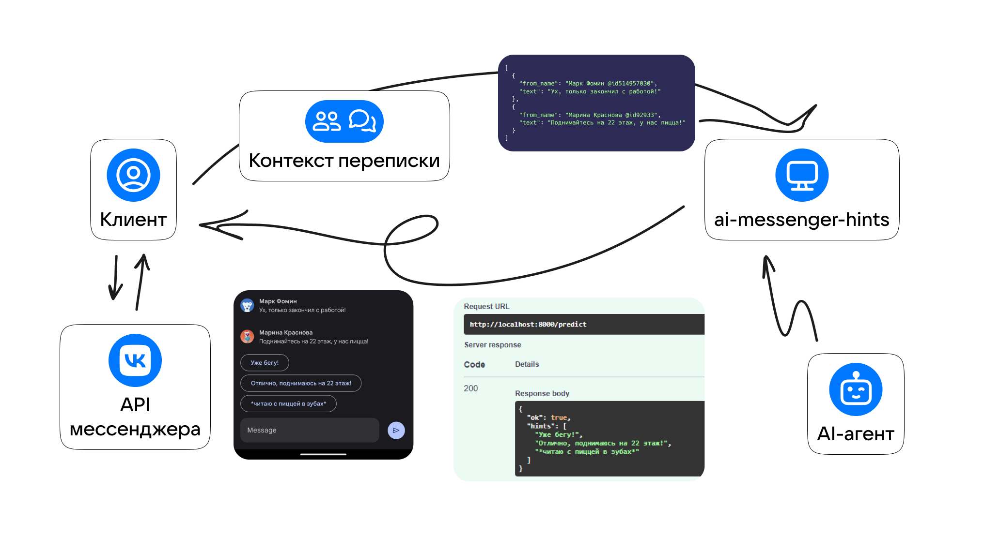

# Документация (RU)


## Что находится в этом репозитории?
Здесь - простой веб-сервер с одним эндпоинтом для генерации подсказок (хинтов) и интеграция с различными AI-агентами.

## Термины
**Веб-сервер (API)** - приложение на основе FastAPI, представляет собой HTTP API с единственным эндпоинтом для генерации подсказок по сообщениям.

**Эндпоинт (конечная точка)** - [см. endpoint](https://en.wikipedia.org/wiki/Endpoint_interface)

**Подсказка (хинт, hint)** - строка с возможным ответом на сообщения, которая генерируется AI-агентом

**AI-агент (также бэкэнд приложения или AI-провайдер)** - сервис генерации текста на основе AI. Надстройкой над AI-агентом (сервисным промптом и парсером хинтов) мы генерируем и нормализируем хинты для ответа API.

**Сервисный промпт** - сообщение, которое отправляется во всех запросах к AI-агенту и ставит задачу генерации хинтов в определенном формате.

**Парсер хинтов** - функция, которая нормализует вывод AI-агента (например, в случае ошибочного/аномального формата вывода) и возвращает список хинтов для ответа API.


## Схема работы приложения
По контексту сообщений (списку последних актуальных сообщений, содержащих текст и информацию об авторе) отправляется запрос с сервисном промптом и сообщениями AI-агенту. В сервисном промпте описана задача AI-агента - сгенерировать подсказки и вернуть их в определенном формате. Полученный ответ AI-агента нормализуется парсером хинтов и возвращается в JSON-формате как response.



## Использование
По умолчанию серверная часть проекта не использует какие-либо библиотеки, привязанные к AI-провайдерам (такие как openai или gpt4free). 
В проекте есть встроенные AI-провайдеры - OpenAI и FreeChurchless без дополнительных зависимостей, которые вы можете использовать сразу.
Вы также можете написать кастомный AI-провайдер (например, используя что-то из gpt4free). Для использования другого AI-провайдера нужно создать класс, который наследуется от `.agents/base_agent.BaseAIAgent` и имплементирует методы `__init__` и `run`. Для примера рассмотрите встроенные агенты [OpenAI](/blob/master/agents/openai.py) и [FreeChurchless](/blob/master/agents/freechurchless.py)

Если ваш API-провайдер требует авторизацию по токену или кредам (например, OpenAI), их нужно передать в `__init__()`:
```python
TOKEN = open("token.txt", encoding="utf-8").read()
agent = MyCustomAIAgent(token=TOKEN)
```
Далее в методе `run()` требуется реализовать запрос к API вашего кастомного AI-провайдера. Секрет, который вы передали, будет доступен как `self.token`. Метод `run()` должен вернуть массив строк с подсказками (пустой массив в случае ошибки). Метод не может вызывать исключения.

Если этих слов недостаточно, посмотрите на реализацию встроенных AI-агентов.

Если вы реализовали свой AI-агент и он работает, буду рад принять pull request на добавление вашей реализации в список встроенных агентов.


## Prompt
Prompt для генерации подсказок хранится в файле prompt.txt. AI-провайдер передает текст prompt как сообщение с role=system, а сообщения пользователей с role=user, что помогает защититься от атак типа prompt injection, **если модель AI (в проекте используется gpt-3.5-turbo) поддерживает это**. Например, некоторые старые модели OpenAI не гарантируют приоритизацию сообщениям с role=system, поэтому важно понимать, что эта защита - не панацея. Именно поэтому важна нормализация ответа от AI в методе `run`.


## Идея реализации
Backend-часть приложения не является моделью, генерирующей подсказки. Вместо этого AI-агент требует отвечать в заданном формате JSON (который валидируется и возвращается клиенту в случае отсутствия ошибок). Использование такого подхода достаточно надежно, с учетом защиты от prompt injection и валидации выходного JSON.

Данный репозиторий содержит реализацию простейшего веб-сервера на основе FastAPI, который взаимодействует с API AI-провайдера описанным способом и всегда возвращает корректный ответ.


## Схема запроса / ответа
Документация доступна на localhost:8000/docs.
### POST /predict

#### Request
Необходимо отправить POST-запрос с массивом объектов типа "сообщение". Описание объектов сообщения:

```python
class Message(BaseModel):
    from_name: str
    text: str
```

Пример запроса:
```json
[
   {
      "from_name": "User 1",
      "text": "Message 1 text"
   }
]
```

#### Response

Ответ сервера содержит поле ok и дополнительные поля, в зависимости от успеха.

При ok=true:
```json
{
   "ok": true,
   "hints": [
      "Подсказка1",
      "Подсказка2"
   ]
}
```

При ok=false может быть возвращено поле exception с текстовым описанием ошибки.
```json
{
   "ok": false,
   "exception":"internal error"
}
```

```json
{
   "ok": false
}
```

### Пример запроса

Пример запроса:
```bash
curl -X 'POST' \
  'http://localhost:8000/predict' \
  -H 'accept: application/json' \
  -H 'Content-Type: application/json' \
  -d '[
  {
    "from_name": "Mark",
    "text": "Привет! Как дела?"
  },
  {
    "from_name": "Ilya",
    "text": "Привет, отлично! Как сам?"
  }
]'
```

```json
{
  "ok": true,
  "hints": [
    "Прекрасно!",
    "Очень хорошо",
    "Все отлично!"
  ]
}
```

## Запуск на сервере и на локалхосте
Читайте инструкцию [тут](https://telegra.ph/Zapusk-FastAPI-proektov-na-komyutere-i-servere-05-23).
## Новости проекта
Следите за новостями:
- ВКонтакте: https://vk.com/vkgptapp
- Мой Telegram-канал (поиск по хештегу VKGPT): https://t.me/difhel_b

## Дополнительные мысли про AI-агенты
Некоторые модели (например, последние от OpenAI) умеют добавлять различных собеседников в chat completions, что позволит модели более точно понимать контекст (кто что писал) и генерировать более точные хинты.

Особые возможности агентов никаким образом не ограничены и могут быть реализованы в `run()`. В этом прелесть инкапсуляции AI-агентов: внутренняя реализация генерации хинтов может быть очень разной и сложной, но входные и выходные данные одинаковы по формату. Это позволяет заменить используемый агент в веб-сервере буквально исправив одну строчку кода.